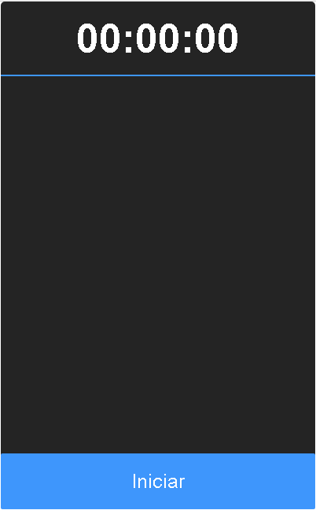
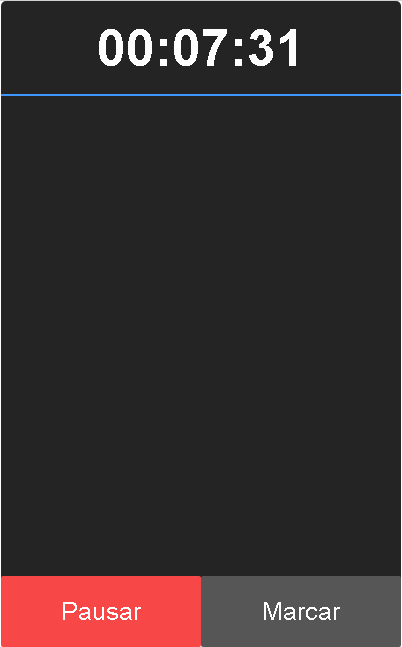
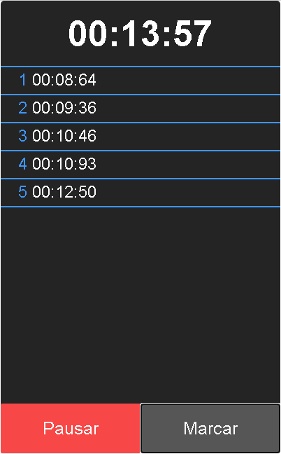
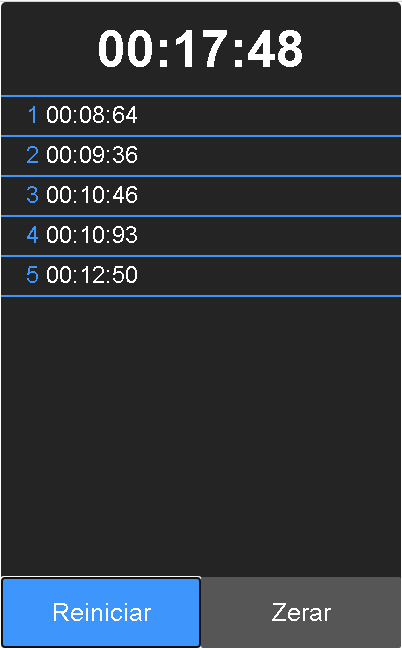

# cronometro

Um cronometro feito utilizando a linguagem javascript.

<h3>Recursos</h3>
  <ul>
    <li>Conta o Tempo</li>
    <li>Pausar/Reiniciar</li>
    <li>Fazer Marcações</li>
    <li>Zerar</li>
  </ul>
  
  <h3>Screenshot</h3>
    <h4 align="center">
      
    </h4>
    <h4 align="center">
      
    </h4>
    <h4 align="center">
      
    </h4>
    <h4 align="center">
      
    </h4>

